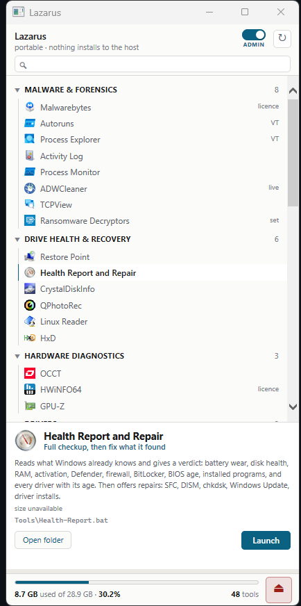
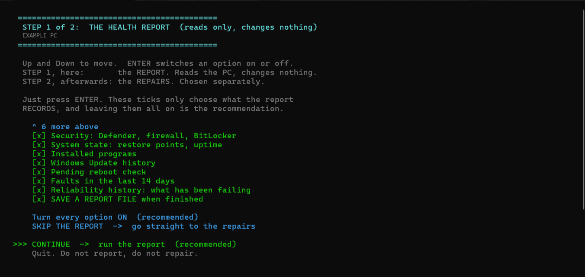

# Lazarus Toolkit

**A portable Windows repair kit that runs off a USB stick and installs nothing on the machine you
are fixing.** Find out what is wrong with a PC, repair it, strip out what should not be there, and
put back what should. Any Windows 10 or 11 machine, yours or somebody else's.

<!-- SCREENSHOT SHOWS 43 TOOLS. Tests\test-docs.ps1 checks that number
     against the launcher's own table and FAILS if they diverge, because
     adding or removing a tool makes this picture wrong and no text
     check can read a PNG. If the test fails: retake the shot, then
     update the number on this line.

     KNOWN STALE AS OF 2026-08-18, AND FAILING ON PURPOSE. Dism++ was
     removed, so the launcher has 42 entries and this picture's footer
     still reads 43. The number here is deliberately NOT bumped to 42:
     doing that turns the check green while leaving the picture wrong,
     which is the exact failure this check was written to catch. Retake
     it from the stick, then set this to 42. -->
<p align="center">
  
  <br>
  <em>Plug in, run <code>Start.bat</code>, pick a tool. Grouped, searchable, and it shows you what
  the stick is carrying at a glance. Click any entry and it says what it does, and how much space
  it takes, before you run it.</em>
</p>

## What it does

| | |
|---|---|
| **Diagnose** | One run tells you the machine, its faults, and how serious each one is. Battery wear, disk health, RAM, drivers, activation, BitLocker, crashes, failed updates |
| **Repair** | Thirteen repairs using Windows' own tools: SFC, DISM, chkdsk, Windows Update, driver installs, each with a time estimate and a restore point offered first |
| **Remove** | Bloatware, adware, hijacked browsers, superseded drivers, and the leftovers a vendor's own uninstaller abandons |
| **Recover** | Deleted files, unreadable disks, Linux and NAS volumes Windows cannot see, and machines that will not boot at all |

## Two halves. Both flagships, and neither needs the other

**1. Our own tools, written from scratch.** Three entries on this stick are ours, Apache 2.0, no
third party involved: **[Health Report and Repair](#health-report-and-repair)**, **Restore Point**
and **Activity Log**. They verify and repair Windows using nothing but data Windows already records
and commands Windows already ships. No bundled driver updater, no registry cleaner, nothing
downloaded at runtime, nothing sent anywhere.

**Health Report and Repair is the one to reach for first.** One command, ninety seconds, and you
know whether the machine in front of you is worth keeping and what is broken. Then it offers to fix
it. **It installs in one line and needs nothing else from this repo.**

**2. The launcher and the stick.** [30 utilities and 5 boot ISOs](#what-is-on-the-stick), the three
above among them, behind a custom UI that groups them, searches them, and explains in a sentence
what each is for and when to reach for it. Almost all are portable and leave nothing behind; the few that do not are flagged in
the launcher and in the tables below. **Adding a tool is one step: drop it in `Tools\` and press
Refresh.** The launcher finds it, works out what to launch, and pulls the icon out of the program
itself. Nothing to edit, no artwork to draw.

Every guard in this project exists because something went wrong on a real computer. The design
notes at the bottom say which.

---

# Take as much or as little as you want

**These three ways of taking it are independent.** Each works on its own, and none needs the others.
Most people want the first.

| | You get | You do |
|---|---|---|
| **1. Health Report only** | The flagship tool. Diagnose and repair a PC using what Windows already has | Run one line. Nothing else is downloaded, ever |
| **2. The launcher, and nothing in it** | The UI, the categories, the search, the admin toggle, the eject check | Clone the repo. Add whichever tools you actually want, one folder each |
| **3. The full kit** | The launcher plus the 30 utilities and 5 boot ISOs listed below | Fetch each tool from its own publisher. Around 8 GB on a 32 GB stick |

### 1. Just the health report

The whole point of this option is that it is one line and it is finished:

```powershell
irm https://raw.githubusercontent.com/SamuelNDCE/lazarus-toolkit/main/install.ps1 | iex
```

No stick, no launcher, no third-party anything. It installs per-user, needs no administrator to
install, and asks for administrator only when you run it. Full detail in
[Health Report and Repair](#health-report-and-repair).

### 2. Just the launcher, then add your own tools

If you want the interface but not our opinion about which tools belong on it:

```powershell
git clone https://github.com/SamuelNDCE/lazarus-toolkit.git
```

**A fresh clone contains no third-party programs at all.** They are not ours to redistribute, so
every entry shows greyed out as missing until you put something there. That is a working starting
point rather than a broken one: **drop any tool into `Tools\`, press Refresh, and it appears**,
launchable, with its own icon pulled out of its binary. See
[Adding your own tools](#adding-your-own-tools).

Health Report and Repair still works immediately in this mode, because it is ours and it is
already in the clone.

### 3. Only the few tools you actually use

There is nothing to configure for this. The launcher lists what the table says should exist and
greys out what is not there, so a stick with six tools on it is not a broken stick, it is a stick
with six tools on it. Fetch the ones you want, ignore the rest, and delete an entry from `DATA` in
`Lazarus.hta` if you would rather not see it greyed out at all.

Health Report answers "what is wrong with this machine". The rest of the stick is there for what
you do next: malware and forensics, drive health and recovery, hardware diagnostics, drivers,
network and remote access, and general file work. **[The full catalogue is
below](#what-is-on-the-stick)**, grouped the way the launcher groups it.

---

# Health Report and Repair

**What it does, in one screen:**

- **Tells you what the machine is:** make, model, serial, BIOS version *and its age*, CPU, GPU,
  motherboard, Windows edition. Reads from the registry, so it works even when WMI is broken.
- **Tells you what is wrong with it:** battery wear, SMART disk health, broken drivers *ranked
  CRITICAL to LOW*, activation channel, BitLocker, firewall, crashes, failed updates.
- **Gives you a verdict:** ready to hand over, usable with notes, or not ready.
- **Then offers to fix it:** 13 repairs using Windows' own tools, each with a time estimate and a
  restore point offered first. Everything that changes the machine is off by default, apart from
  the standard SFC repair, which is the one you almost always want.
- **Collects every log the job left behind:** 25 locations across Windows, your repairs and any
  antivirus tools that ran, into one dated folder.
- **Never sends anything anywhere.** See below.

---

**Install it in one line. It needs nothing else from this repo.**

```powershell
irm https://raw.githubusercontent.com/SamuelNDCE/lazarus-toolkit/main/install.ps1 | iex
```

That is the whole install. It takes a few seconds and asks nothing.

**Afterwards you can start it three ways**, whichever you find first:

| | |
|---|---|
| **Start menu** | Type "Health Report" |
| **Desktop** | The Health Report and Repair icon |
| **Terminal** | Type `health-report` |

**It will ask for administrator when it runs. Say yes.** Battery wear, SMART disk data, Windows
activation and BitLocker cannot be read without it, and every repair needs it. Installing needs no
administrator at all: those are two different permissions, and the installer only ever asks for
the smaller one.

Prefer to read the code first, which is the honest recommendation for anything you pipe into a
shell:

```powershell
git clone https://github.com/SamuelNDCE/lazarus-toolkit.git
cd lazarus-toolkit
.\Tools\Install.bat
```

Or do not install it at all. **Copy `Tools\` anywhere and run `Health-Report.bat`.**
It has no installer to depend on, no registry keys it needs, and no path baked into it. The
installer exists to make it convenient, never to make it work.

## Your data never leaves your machine

This is the short version, and it is checked rather than promised:

- **No telemetry, no analytics, no accounts, no phone-home.** The report,
  the log collector and the report cleaner contain **zero** network calls of any kind. Not
  disabled by a setting, not off by default: absent from the code.
- **Nothing is uploaded, ever.** Reports are written to the folder the tool runs from, on your
  disk, and stay there until you delete them.
- **You choose whether anything is written down at all.** Untick **SAVE A REPORT FILE** on the
  first screen and the tool shows you everything and writes nothing.
- **The only thing that touches the internet** is the optional *"Install driver updates from
  Windows Update"* repair, which talks to Windows Update the same way Windows itself does. It is
  off by default and you have to switch it on.
- **The installer downloads once, from GitHub, and that is all.** After that the tool never
  connects to anything.

You can verify the first point in about five seconds:

```powershell
Select-String -Path .\Tools\*.ps1 -Pattern 'Invoke-WebRequest|Invoke-RestMethod|WebClient|DownloadFile|Send-MailMessage'
```

**That returns nothing at all.** The one downloader in this repo is the top-level `install.ps1`,
which is the web installer and is not part of the tool: it fetches the toolkit once and then plays
no further part. Nothing under `Tools\` can reach the network except the Windows Update repair.

**A saved report does contain private information about the machine it ran on**: name, make,
model, serial number, installed programs and event log entries. That is the point of it, and it
is why it stays on your disk and why you can switch saving off. See
[Where reports go](#where-reports-go-and-what-is-in-them).

---

**Requirements:** Windows 10 or 11 and Windows PowerShell 5.1, which is already on both. Nothing to
download, no runtime, no dependencies.

## What it replaces

Every finding is traceable to a real Windows data source, and every repair is a command you could
have typed yourself if you had remembered it and the order. In one run, it replaces all of this:

| Instead of | You get |
|---|---|
| `winver`, Device Manager, `dxdiag`, System Information | Machine, Windows edition, CPU, GPU, motherboard, BIOS and its **age** |
| `powercfg /batteryreport` and reading the XML | Battery wear percentage and cycle count, in a line |
| CrystalDiskInfo, `wmic diskdrive` | SMART health, power-on hours, reallocated sectors, SSD write life |
| `slmgr /dlv` | Activation state and **which channel**, which is what tells you a volume licence will die |
| `manage-bde -status` | BitLocker state, with a warning not to assume "unknown" means "off" |
| Scrolling Event Viewer | The faults that actually matter, ranked |
| Device Manager, squinting at yellow triangles | Broken devices **graded CRITICAL to LOW**, plus generic-vs-vendor drivers and driver ages |
| `sfc`, `dism`, `chkdsk`, `netsh winsock reset`, Disk Cleanup, remembering the order | A menu, with time estimates, a restore point offered first, and stall detection |

**Driver severity is the part worth understanding.** A missing network driver and a missing
card-reader driver are not the same emergency. Network is CRITICAL on its own terms, because *a
machine with no network driver cannot download its own network driver*, so the report tells you to
fetch it elsewhere or USB-tether a phone.

## It asks what you want first

<p align="center">
  
  <br>
  <em>The cursor opens on <strong>CONTINUE</strong>, so the common answer is one keypress. The
  ticks only decide what the report records, and leaving them alone is the recommendation.</em>
</p>

The first screen is a chooser: up and down to move, Enter to switch a row on or off. **It opens
with the cursor already on CONTINUE**, so if you want the normal run you press Enter once and
never think about it.

**Press Enter and you get everything, and a saved report.** That is the default and it is what the
tool has always done. The chooser exists for the jobs it could not do before:

- **"Just tell me what this machine is."** Leave only Machine ticked. Make, model, motherboard,
  BIOS and CPU in about two seconds.
- **"Do not write anything down."** Untick the last row, **SAVE A REPORT FILE**. Everything appears
  on screen and nothing touches the disk.
- **"Skip the slow ones."** The program list and the update history are the two slowest checks.

Anything you leave out is **named in the report**, because a file that silently omits three
sections is indistinguishable from a run where those checks found nothing, and that ambiguity is
the one thing a handover record must not have.

From the command line, with no keypress at all:

```powershell
health-report                        # ask, then run
health-report -Only 'M,A,B'          # only these sections
health-report -Skip 'U,P'            # everything except these
health-report -NoSave                # show it, write nothing
health-report -Unattended            # everything, saved, no keypresses
health-report -NoElevate             # deliberately run as a standard user
```

| Key | Section | What you learn |
|---|---|---|
| `M` | Machine | Make, model, serial, BIOS version and **age**, CPU, GPU, motherboard |
| `A` | Windows activation | Licensed or not, and by which channel |
| `B` | Battery | Design vs full-charge capacity, wear percentage, cycle count |
| `D` | Storage | SMART data, power-on hours, reallocated sectors, SSD write life, free space |
| `R` | Memory | Sticks installed, speed, slots used |
| `V` | Drivers | Broken devices ranked by severity, generic-vs-vendor drivers, driver ages |
| `S` | Security | Defender, firewall, BitLocker, registered antivirus, Absolute/Computrace |
| `T` | System state | Restore points, uptime |
| `P` | Installed programs | Full program list, cross-checked against the registry |
| `U` | Windows Update | Recent installs and failures |
| `E` | Pending reboot | Whether a restart is already queued |
| `F` | Faults, last 14 days | Unexpected shutdowns, blue screens, disk errors, hardware faults |
| `Y` | Reliability history | App crashes, hangs and failed updates, and when they started |
| `W` | Save a report file | Untick to write nothing to disk |

## The repairs

Chosen the same way. **Nothing is assumed.** Anything that modifies the machine is tagged
`CHANGES` and offers a restore point first. All of them are **off by default** except the standard
SFC repair, which is ticked because it is the one you almost always want and it skips DISM unless
SFC actually finds damage. The menu shows a time estimate and a plain description for whatever is
highlighted.

**Everything in this menu changes the machine.** The read-only checks that used to live here,
the event log sweep and the reliability history, are report sections now: they collect what
Windows already recorded and repair nothing, so a repair menu was the wrong place for them. A
menu called "repair" whose entries mostly do not repair anything trains you to skim it, and the
entries that *do* change a machine are the ones that must never be skimmed.

The one exception is the disk check, which is read-only and stays, because the repair that fixes
what it finds depends on it and `chkdsk` must not be run twice over one pass.

| Repair | Changes the PC | Roughly |
|---|---|---|
| Repair system files: SFC, then DISM, then SFC | yes | 2 to 30 min |
| Check the disk for errors (online, no reboot) | no | 1 to 15 min |
| Check whether this PC *can* install drivers (dry run) | no | under 3 min |
| Install driver updates from Windows Update | yes | 1 to 15 min |
| Also **repair** what the disk check finds | yes | varies |
| Test the RAM | yes | reboot |
| Reclaim disk space from old Windows updates | yes | 1 to 20 min |
| Repair Windows Update | yes | under 3 min |
| Reset the network stack | yes | seconds, then reboot |
| Clear out temp files | yes | under 3 min |

**`SFC → DISM → SFC`** is on by default, with DISM skipped unless SFC finds damage, because DISM
adds 10 to 40 minutes and a clean SFC usually means there is nothing for it to do. Untick that
sub-option when a machine misbehaves but SFC insists it is fine, which is the one case a clean SFC
cannot rule out. **DISM is what checks the component store**, and SFC compares Windows *against*
that store, so a damaged store makes SFC report clean on a machine that plainly is not.

### Clearing temp files: there are three temp folders, not two

`%WINDIR%\Temp` and your own `%LOCALAPPDATA%\Temp` are the obvious pair. The third belongs to the
**SYSTEM account**, under `System32\config\systemprofile`, and every service and installer that has
ever run as SYSTEM wrote into it. Nothing routine empties it, Disk Cleanup included, so on a
machine that has been in service for years it is frequently the largest of the three. And on a
handed-down laptop, every account that ever signed in has one of its own.

It clears all of it: the three temp folders, **every other user profile's temp**, the Windows
Update download cache, the Delivery Optimization cache (peer-to-peer update chunks, routinely
several GB), crash dumps, prefetch and the recycle bin.

Files in use are skipped rather than forced, and counted rather than hidden. Two things are
deliberately left alone and **said out loud** rather than silently omitted: **`C:\Temp`**, because
Windows did not create it and on these machines it has held the only copy of a driver, an installer
and once a set of photographs; and **`Windows.old`**, which the "old Windows updates" repair
reclaims properly so the 10-day rollback window stays honest.

## Collecting the logs other tools leave behind

Your repairs write their own log. Everything else writes somewhere on the machine you are fixing.
Finish a job and the evidence is scattered across a dozen directories on a PC you are about to hand
back.

```powershell
.\Tools\Collect-ToolLogs.ps1 -WhatIfOnly   # show what it would take
.\Tools\Collect-ToolLogs.ps1               # copy it
```

It sweeps 25 known locations:

- **Your repairs:** CBS.log and older CBS logs, dism.log and older DISM logs
- **Servicing and update:** the Windows Update client, update medic, SIH sessions, feature-update
  eligibility, SetupDiag, and Panther's `setupact`/`setuperr` for upgrades that rolled back
- **Drivers and hardware:** `setupapi.dev.log`, which is every driver install and removal in order,
  plus DDU, DriverStore Explorer, and **minidumps**, which are the difference between "it blue
  screens sometimes" and knowing which driver did it
- **Crashes:** Windows Error Reporting archives
- **Antivirus and cleanup:** Defender, Malwarebytes service logs and scan results, ADWCleaner in
  both its old and current locations, KVRT, BleachBit, BCUninstaller, OCCT, Win11Debloat

Everything lands in one dated folder with an `index.md` saying what was found **and what was not**,
because absence is a finding: it usually means that tool was never run here.

It distinguishes **"nothing here"** from **"needs administrator"**. Defender's log folder, the WER
archive and parts of Panther are readable only by an administrator, and unelevated they enumerate
as empty *with no error at all*. Reporting that as "Defender left no log, which usually means it
was never run" is a lie in the one direction that matters.

**It only ever copies.** Nothing is moved, nothing is deleted, the machine is left exactly as it
was. Files over 20 MB are skipped with the size and the reason stated.

## Clearing the saved reports

```powershell
.\Tools\Clear-Reports.ps1              # dry run, grouped by machine
.\Tools\Clear-Reports.ps1 -Confirm     # do it
.\Tools\Clear-Reports.ps1 -Keep 'MYPC' # spare one machine's records
```

## Uninstalling

**The normal way:** Windows Settings > Apps > Installed apps > Health Report and Repair >
Uninstall. It is a normal Windows entry and behaves like one.

**Or from a terminal**, which shows you exactly what would go before it goes:

```powershell
.\Uninstall.ps1              # dry run, shows exactly what would go
.\Uninstall.ps1 -Confirm     # do it
.\Uninstall.ps1 -Confirm -RemoveReports
```

**Nothing is left behind, and nothing of yours is taken with it.**

- The installer records every single file it wrote in `installed.json`, and the uninstaller
  removes exactly that list. Anything else in the folder is left alone and named on screen.
- **Your saved reports are never deleted.** They are moved to `Documents\Lazarus Reports` and the
  new location is printed, because uninstalling a tool is not a statement about your records.
  `-RemoveReports` deletes them, and you have to ask for that separately.
- The PATH entry and the Add/Remove Programs entry are removed too. A dry run is the default, so
  you always see the list before anything happens.

---

# Where reports go, and what is in them

Both tools save **next to themselves**, in the same folder as the scripts. On a USB stick that
means every machine you touch collects in one place, which is the point. If that folder is not
writable it falls back to Documents, then Desktop, then Temp, and always says where the file went.

```
report-<MACHINE>-<date>_<time>.md     the health report
repairlog-<MACHINE>-<date>_<time>.txt written by the repair tool
toollogs-<MACHINE>-<date>_<time>\     collected from other tools
```

**One file per health report, in Markdown.** It opens in any editor, renders on GitHub, pastes into
a ticket, and can be handed straight to an AI to summarise. Plain text does none of that better.

## Please read this bit

**A report contains the machine name, make, model, SERIAL NUMBER, installed software and event log
entries of the computer it ran on.** On someone else's machine, that is their data.

- Do a dozen repairs and the stick is quietly carrying a dozen hardware inventories
- Fine in your pocket; not fine if the stick is lost, lent, or imaged
- **Untick "save a report file" at the start** when you only need to look. That is what it is for
- `Clear-Reports.ps1 -Confirm` clears what has accumulated
- `.gitignore` excludes every report, which matters because a checkout of this repo **is** a working
  toolkit: you run it, it writes reports, and an unattended `git add -A` would sweep them in

**Nothing is ever transmitted.** No telemetry, no upload, no phone-home, no network access at all
except the driver-update repair, which talks to Windows Update and nothing else.

---

# The Lazarus USB stick

The launcher, for when you want the health report *and* the rest of the kit on one stick.

```powershell
.\Start.bat
```

That opens `Lazarus.hta`, the graphical launcher. **Everything under `Tools\` is a self-contained
program you can also run directly**, without the launcher and without the rest of the toolkit. The
launcher is a front door, not a wrapper.

The third-party utilities are **not** bundled here (see [Licensing](#licensing)), so a fresh clone
shows those greyed out as missing until you add them. Health Report and Repair works immediately
with nothing downloaded.

## What is on the stick

Thirty utilities and five boot ISOs, in the order the launcher shows them.

**The Notes column is the licence position**, because "free" and "free for paid work" are not the
same thing and the difference matters if you charge for repairs. Full detail, with the wording each
vendor actually uses, is in [`Docs/LICENCES.txt`](Docs/LICENCES.txt).

### Malware and forensics

| Tool | What it is for | Notes |
|---|---|---|
| **Malwarebytes** | Full scan and clean, detections always current | Installs, it is not portable. Free tier is **not licensed for business devices** |
| **Autoruns** | Every autostart hook malware uses to survive a reboot | Sysinternals. Yours to use, **not yours to pass on** |
| **Process Explorer** | Identify a suspicious running process, check it against VirusTotal | Sysinternals, same terms |
| **Process Monitor** | Live capture of every file, registry and network event | Sysinternals, same terms |
| **TCPView** | See what a process is talking to | Sysinternals, same terms |
| **ADWCleaner** | Strip adware, toolbars and hijacked browsers | Free and portable |
| **Activity Log** | What has been run on a machine, even with auditing off | Ours, Apache 2.0 |

### Drive health and recovery

| Tool | What it is for | Notes |
|---|---|---|
| **Health Report and Repair** | Full checkup, then fixes what it found | Ours, Apache 2.0 |
| **Restore Point** | A rollback point before you change anything | Ours, Apache 2.0 |
| **CrystalDiskInfo** | SMART health per drive, one colour-coded verdict | MIT |
| **QPhotoRec** | Recover deleted files by signature, even after a format | Open source |
| **Linux Reader** | Read ext4, ZFS, XFS, Btrfs and APFS volumes from Windows | Freeware, closed source |
| **HxD** | Edit raw disks, RAM and boot sectors | Free for private **and** commercial use |

### Hardware diagnostics

| Tool | What it is for | Notes |
|---|---|---|
| **HWiNFO64** | The most complete and accurate sensor readout there is | Free for **non-commercial** use only |
| **GPU-Z** | Identify and verify a graphics card, including fakes | Free commercially. Do not redistribute in a paid package |

### Drivers

| Tool | What it is for | Notes |
|---|---|---|
| **Display Driver Uninstaller** | Graphics corruption a reinstall will not fix. Run in Safe Mode | Terms ship with the download, **not verified** |
| **DriverStore Explorer** | Purge the superseded driver packages Windows never deletes | GPL-2.0 |

### Network and remote

| Tool | What it is for | Notes |
|---|---|---|
| **WinSCP** | Move files to and from Linux boxes | GPL-3.0 |
| **WindTerm** | SSH, SFTP, telnet and serial in one window | Open source |
| **Angry IP Scanner** | Sweep a subnet for live hosts, no driver to install | Open source |
| **Firefox** | A clean browser when the machine's own is hijacked | Distribute **unaltered** only |

### Files and utilities

| Tool | What it is for | Notes |
|---|---|---|
| **BCUninstaller** | Rip out bloatware, and the leftovers its uninstaller abandoned | Open source, no limit on client work |
| **Win11Debloat** | Strip preinstalled junk and telemetry from a new laptop | MIT |
| **WizTree** | Find what filled a drive, in seconds, by reading the MFT | Free tier is **non-commercial** |
| **Everything** | Find any file instantly by name | Freeware |
| **7-Zip** | Open literally any archive, and most installers | LGPL. Fine on commercial machines |
| **Notepad++** | Edit config and log files without mangling them | GPL |
| **Double Commander** | Two panes, batch rename, folder compare, runs elevated | GPL-2.0 |
| **BleachBit** | Reclaim space and clear traces, auditably | GPL-3.0 |
| **Rufus** | Write bootable media, or revive a stick Windows will not format | GPL-3.0 |

### Boot ISOs

Not launchable from the stick. Reboot and pick them from the Ventoy menu.

| ISO | What it is for | Notes |
|---|---|---|
| **Hiren's BootCD PE** | Windows will not boot at all. About 90 tools in a Windows 11 PE | Windows PE base is Microsoft licensed. Publisher only |
| **Kaspersky Rescue** | Malware that survives inside Windows. Scans with the OS shut down | Terms not re-verified |
| **SystemRescue** | Repair Linux filesystems and partitions | Open source |
| **Rescuezilla** | Image or clone a whole drive before a risky repair | Open source |
| **MemTest86+** | Prove whether RAM is faulty, with no OS holding any of it | GPL-2.0 |

## Adding your own tools

**Drop the folder in `Tools\` and press Refresh. That is the whole requirement.** The launcher
scans `Tools\` on every refresh, finds anything it has no entry for, works out what to launch, pulls
the icon out of the program's own binary, and lists it under **Found in the Tools folder** with a
`found` pin. Portable builds work best, since nothing is installed.

It picks the entry point the way you would: a `.bat` or `.cmd` at the top of the folder wins,
because that is what a portable build ships to set its environment up. Otherwise it takes the
largest `.exe`, skipping the uninstallers, updaters and crash reporters that sit beside the real
program.

**The `found` pin is the point.** It says the category and the description were guessed rather than
written, so a tool nobody has described never looks the same as one that has been checked. To
promote it out of that group, give it a real entry:

**1. Put the tool in `Tools\<Name>\`.** Portable builds work best, since nothing is installed.

**2. Add one entry to the array in `Lazarus.hta`:**

```javascript
["Your Tool","Tools\\YourTool\\yourtool.exe","One line on what it is for",
 "The longer description shown when this row is highlighted.","",""],
```

| Field | What it is |
|---|---|
| 1 | Name shown in the list |
| 2 | Path from the stick root, with `\\` doubled |
| 3 | Short purpose, **44 characters max** |
| 4 | Full description, **269 characters max** |
| 5 | Tag: `AV` if antivirus will flag it, `boot` for ISOs, `temp` for one-offs, else `""` |
| 6 | Row class: `t-dang` (red) or `t-warn` (amber) for anything risky, else `""` |

**3. Icons need no work at all.** `Tools\Get-Icons.ps1` reads each icon out of the tool's own
binary and caches it in `Icons\`, named after the tool with everything but letters and digits
stripped, which is the same name the launcher looks for. There is no map to keep in step and no
artwork to draw.

```powershell
.\Tools\Get-Icons.ps1          # add anything missing
.\Tools\Get-Icons.ps1 -Force   # re-extract everything
```

`Icons\` is a cache and is gitignored. The only committed icons are the three for Health Report,
Restore Point and Activity Log, which are our own scripts and have no binary to read.

**4. Check it before trusting it:** `node Docs\validate.js .` verifies every path exists, every
icon resolves, and no field is over length. It also lists tool folders on disk that are missing
from the launcher, which catches the case where you copied a tool in and forgot the entry.

## Ejecting safely

**Use the eject button in the launcher.** It checks nothing is still running from the stick, names
anything that is, and releases the drive.

**Then use Windows' own Safely Remove Hardware as a second check.** The launcher's eject can only
see the handles it knows to look for; an antivirus mid-scan or a file still open elsewhere can make
it report success while a write is unfinished. Two signals cost you three seconds. Losing a stick of
client reports to a half-finished write does not.

Before you walk away with it:

```powershell
.\Tests\Test-StickReady.ps1 -Drive D:
```

That is the fuller check: volume health, every script parses, every launcher target exists, nothing
left behind, and the stick still takes a write.

---

# If something looks wrong

| What you see | What it is | What to do |
|---|---|---|
| Every hardware section blank, run takes forever | WMI is wedged on that PC | The tool says so in a red box within 15 seconds and skips the WMI-only sections. Reboot; or `net stop winmgmt` then `net start winmgmt`; or `winmgmt /salvagerepository` |
| Display frozen, nothing moving | You clicked in the window and started a text selection, which blocks all output | Press **Enter** or **Esc**. The tools disable this at startup, but if it happens on a console they could not configure, that is the fix |
| DISM parked on one percentage | Normal, for a while. It genuinely pauses while repairing files | Wait. At 10 minutes of log silence it warns; at 25 it says it is stuck. Then Ctrl+C, reboot, run again |
| "Repairs can half-apply" warning | A reboot is already pending | Reboot first. A pending reboot is the most common cause of DISM hanging forever |
| A `.bat` flashes and vanishes on a locked-down PC | AppLocker killed it before it could elevate | Use the Start menu shortcut, which carries the run-as-admin flag and is not evaluated by AppLocker |
| Serial says "not set by the manufacturer" | The board reports a placeholder, common on custom desktops | Use the sticker on the case or the board |
| Driver download fails immediately | Windows Update will not download for a standard user | Let it elevate, or start from `Health-Report.bat` |
| "No driver updates offered" | May be true, may be a network blip | The search retries three times. If it still says none, run the **dry run** option to prove the pipeline works |
| A check says "timed out" | That one call did not answer; everything else still ran | The report names what is missing. Usually a wedged service; a reboot clears it |
| SMART or BitLocker "needs administrator" | It was run unelevated | **Do not** assume the disk is unencrypted |
| A section is missing from the report | You unticked it at the start | The report names what was left out, near the top |
| Tool diagnostics section in the report | A bug in **this tool**, not a finding about the PC | Please report it. The findings above it are unaffected |

---

# Capabilities

The tick means it has been exercised on a real machine, not merely written.

| Health report | Verified |
|---|---|
| Machine, activation, battery, storage, memory | yes |
| Drivers, with severity ranking | yes |
| Security, system state, installed software, update history | yes |
| Verdict, Markdown output, `-Unattended` | yes |
| Choose which sections to include, and whether to save | yes |
| Machine and BIOS read from the registry, no WMI needed | yes |
| WMI health probe before the run | yes, caught a genuinely wedged WMI |
| Elevates itself however it was started | yes |

| Repairs | Verified |
|---|---|
| Repair system files: SFC, then DISM, then SFC | yes |
| Skip DISM unless SFC finds damage (default) | yes |
| Check the disk for errors (online, no reboot) | yes |
| Read the drive's own SMART health data | yes |
| Sweep the event log for real faults | yes |
| Reliability history | yes |
| Find devices with missing or broken drivers | yes |
| Install driver updates from Windows Update | yes, 9 drivers installed |
| Check whether this PC CAN install drivers (dry run) | yes |
| Reclaim disk space from old Windows updates | yes |
| Repair Windows Update | yes |
| Reset the network stack | yes |
| **Clear out temp files** | **yes, freed 60.61 GB on a client machine** |
| Also REPAIR what the disk check finds | partly: it ran and correctly skipped `/spotfix` on a clean disk. The repair itself has not had a damaged volume to fix |
| Test the RAM | not yet |

| Reliability | Verified |
|---|---|
| Timeout and spinner on every slow call | yes |
| Stall watchdog on DISM and SFC | yes, caught a real one-hour DISM hang |
| Retry on transient Windows Update failures | yes |
| QuickEdit disabled so a stray click cannot freeze a run | yes |
| Tool errors recorded separately from findings about the PC | yes |
| Runs unattended with no keypress | yes |
| Per-user install, uninstall, and shortcuts that elevate | yes |
| Serial parsed from the SMBIOS table with no WMI | partly: it correctly rejects the placeholder this board reports, but has not yet run on a machine with a real serial to return |

---

# Checks

```powershell
.\Tests\Run-Checks.ps1                                     # this checkout
.\Tests\Run-Checks.ps1 -Root D:\Tools         # a deployed stick
.\Tests\Test-StickReady.ps1 -Drive D:                      # before unplugging
.\Tests\test-stall-detection.ps1                           # real SFC/DISM watchdog firing, ~2.5 min
```

`Run-Checks` exits 0 or a failure count, so it can gate a commit. It verifies syntax, that every
command resolves, that no function is used before it is defined, that there are no duplicate
functions or dead variables, that no slow call was added without a progress indicator, that every
box renders as a true rectangle, that the watchdogs start and stop, that retry behaves, that the
shared picker navigates and toggles and refuses an empty START, and that nothing personal is about
to be published.

`test-stall-detection.ps1` is deliberately **not** part of `Run-Checks`. Everything else in `Tests\`
finishes in seconds; this one needs two real 30-second poll cycles per case to prove the watchdog
actually prints a warning on a genuinely stale log, not just that the function starts and stops
without throwing (`test-watchdogs.ps1` already covers that, fast). Run it by hand when touching
`Start-StallWatch` or either SFC/DISM repair path.

It also runs each checker against `Tests/Fixtures/broken.ps1`, a deliberately wrong file, to prove
the checkers still fail when they should. That is not ceremony: the dead-variable check was silently
a no-op for a while because a hashtable key named `keys` shadowed the `.Keys` member, and it
reported a clean project having examined nothing.

The privacy check runs on **every** check rather than being something to remember before a launch,
because that is exactly what failed once: this repo went public with a client's first name in five
comments and every secrets scan beforehand passed. A credential regex has nothing to say about
somebody's first name. It scans **git history** as well as the working tree, because deleting a
name from a file leaves it in every earlier commit.

---

# Design notes

Worth reading if you are modifying it. Most are scars.

**Nothing silently gives up, and nothing runs silently.** Every slow call has a visible timeout and
announces when it stalls. `Run-Checks` fails the build if a slow call is added with no spinner, no
announcement and no progress of its own.

**A timeout is a safety net for a call that *might* hang, and the wrong tool for one already known
to be doomed.** When the WMI probe fails, the sections that are nothing but WMI are skipped
outright rather than each waiting 20 seconds for a call that cannot answer. That took a run on a
wedged machine from 258 seconds to 77.

**Prefer the registry to WMI wherever the data is in both.** Make, model, motherboard, BIOS version,
BIOS date, CPU and Windows edition are all in `HKLM\HARDWARE\DESCRIPTION\System\BIOS`, populated
from SMBIOS at every boot, and read in about 100ms. Four 20-second WMI calls used to sit on the
critical path of the very first section, which is where a slow start is most visible.

**Parse dates with an explicit format.** The registry writes the BIOS date US-style regardless of
locale, so a bare `[datetime]` cast reads `03/09/2026` as 3 September on a UK machine and reports
the wrong firmware age.

**A placeholder is not a fact.** `Win32_BIOS` hands back "To be filled by O.E.M." verbatim on most
custom-built desktops, and printing that under a heading saying "Serial" states something untrue.

**A switch that is accepted and does nothing is worse than one that is rejected.** `-Unattended` was
once thrown away at the elevation step and the run sat forever on "Press Enter to close".
`-Only`, `-Skip` and `-NoSave` were briefly inside the block `-Unattended` skips, so
`-Unattended -Only 'E'` silently ran all eleven sections.

**No question in the middle of a run.** A prompt underneath a wall of output is indistinguishable
from a freeze. Questions come before work starts, or are queued and asked at the end. That is why
the chooser is the first screen and not a series of prompts.

**Absence and refusal are different findings.** A folder that is empty and a folder you were not
allowed to read look identical to code and mean opposite things to a person.

**QuickEdit is disabled at startup.** One click in a Windows console starts a text selection, which
blocks every write the script makes. It looks exactly like a crash, and somebody watching a slow
repair *will* click the window.

**Log silence, not CPU, detects a hang.** DISM idles at 0% CPU while perfectly healthy, and can sit
on a percentage forever while dead. Whether its log is still being written is the only honest signal.

**Elevation belongs in the script, not only in its launcher.** A tool can be started from a `.bat`,
a shortcut, the launcher, or an already-open console, and only some of those elevate. PowerShell
also resolves a bare `health-report` to the `.ps1` rather than the `.cmd` beside it. The same
applies to console colours, which is why every script repaints on entry.

**Elevate from outside the process on locked-down machines.** Under AppLocker an unelevated
administrator holds a filtered token where the Administrators SID is deny-only, so an
"Administrators Allow" rule does not match and a script on removable media is killed before it runs
a line. A `.lnk` is not an executable and is never evaluated, so the run-as-admin flag on a shortcut
gets past it. That flag has no COM property: it is byte `0x15`, bit `0x20` of the shortcut header.

**Per-user installs must not elevate.** The install goes into `%LOCALAPPDATA%`, so elevating would
install into the *administrator's* profile and the shortcuts, PATH entry and uninstall entry would
all land on an account nobody is using.

**Verify against the machine, not against your own return codes.** "Copy-Item did not throw" and
"the file is there and it parses" are different claims. The installer checks the second.

**One picker, two callers.** The arrow-key chooser is fiddly code with a long history of
frame-painting bugs, so there is exactly one copy in `Common.ps1` and both tools call it. A second
copy would have had to re-learn every one of those bugs. The frame is written in a single console
write, because per-line drawing visibly rebuilds the menu top-down on every keypress and *that* is
the glitch, not the cursor arithmetic.

**`continue` inside a PowerShell `switch` exits the switch and falls through.** A switch IS a loop.
That made every START, Cancel and spacer row draw a second empty `[ ]` underneath itself.

**Clear the screen and draw it. Do not calculate where the last frame went.** The picker's
redraw was "fixed" five times by working out where to put the cursor: a remembered row, the top of
the visible window, stepping back N lines, then homing with ESC[H. Each was verified against a
captured escape stream, each looked correct, and each still stacked copies of the menu on a real
terminal. Clear-Host goes through the console API, depends on no escape sequence, no viewport
position inside a 9999 row buffer and no count of anything, and worked first time. A menu that
flickers is a menu you can use.

**Verify on the console it runs on, not the one you are testing from.** All five of those captures
were taken in a redirected shell, where VtEnabled and CanAnimate are both false. They proved the
ANSI branch worked while the reported failure was somewhere else entirely. Tools\Show-ConsoleFacts.ps1
exists so the real console can be asked instead of assumed.

**Boxes size themselves.** Hand-counted padding drifted and left ragged edges.

---

# Licensing

The scripts, launcher and documentation here are **Apache 2.0**. See `LICENSE`. Free to use, modify
and redistribute, including commercially.

**The third-party utilities are not included here and are not ours to redistribute.** `.gitignore`
excludes `*.exe`, `*.msi`, `*.zip`, `*.7z`, `*.iso` and the contents of `Tools\`, so a clone carries
our scripts and nothing of anybody else's. Each utility is fetched from its own publisher and stays
under its own licence. Some, such as Hiren's BootCD PE, contain Microsoft-licensed components and
can only ever be obtained from their publisher.

That is a deliberate position rather than a size decision. It also means the licence question that
matters is about *use*, not redistribution: a few of these tools are free for personal use and not
for paid work, which is a real distinction if you charge for repairs.

**[`Docs/LICENCES.txt`](Docs/LICENCES.txt) has the detail**, quoting the wording each vendor
actually uses. The two worth knowing without opening it:

| Tool | The catch |
|---|---|
| **Sysinternals** | Yours to use on your own devices. Not to publish, lend, or transfer to anyone else |
| **Malwarebytes** | The free product is not licensed for threat removal on business devices |

There was a third, and it is the reason this section is worth reading. **OCCT's free licence is
personal use only**, excluding "any commercial purposes in any form whatsoever", with prosecution
named in the licence text. Stress testing a machine you are being paid to repair is commercial use.
It has been removed from the kit rather than carried with a warning attached, and it should not be
added back without buying the Premium licence.

That is a reading of published licence text, not legal advice.

> **Not built yet:** an automatic `Get-Tools.ps1` to fetch each utility. Until then the third-party
> tools are a manual step. Health Report and Repair, which is the substance of this project, needs
> nothing downloaded.

---

Built by [Perpetual Technologies](https://perpetualtechnologies.co.uk). Issues and pull requests
welcome.
